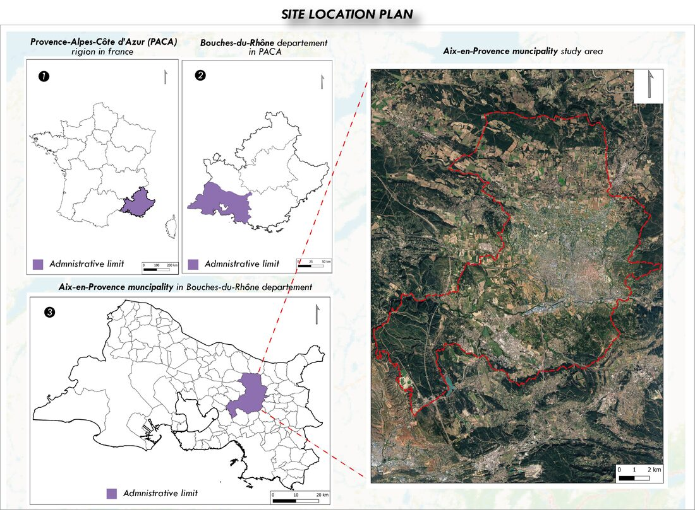
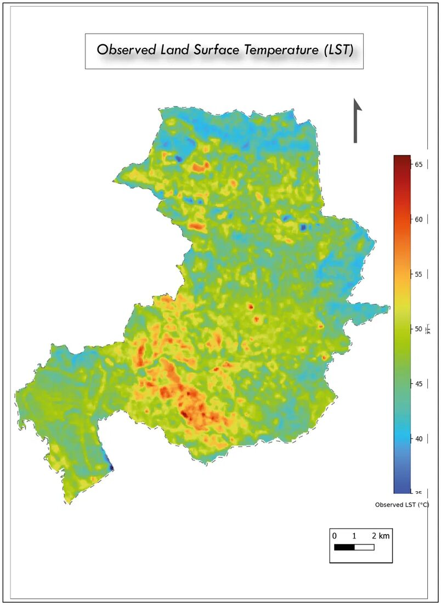
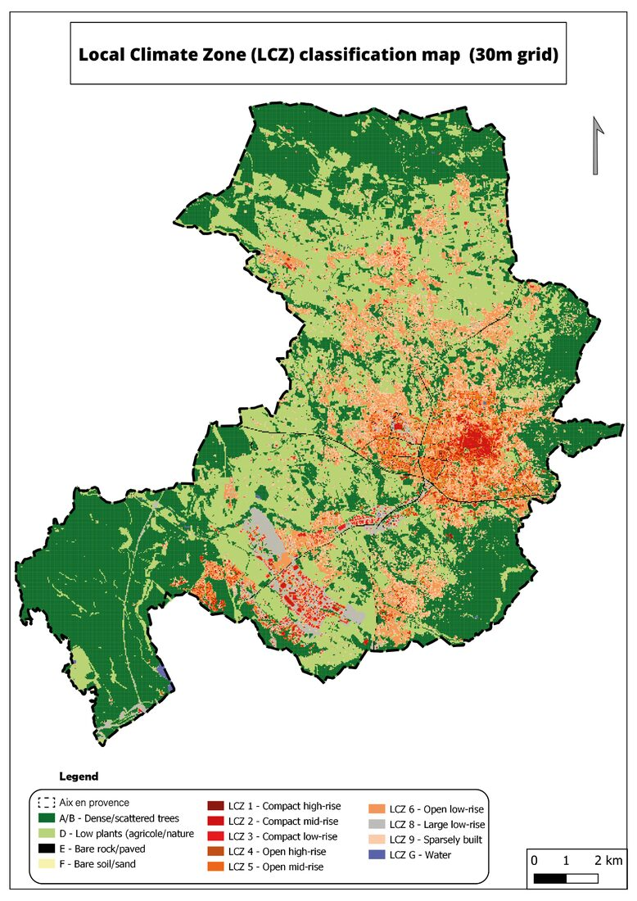
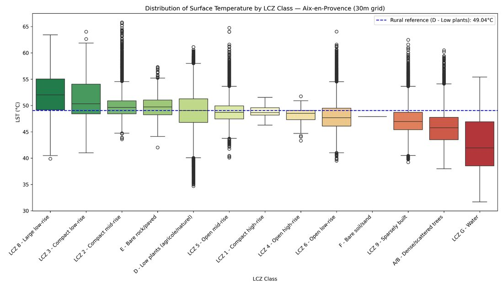
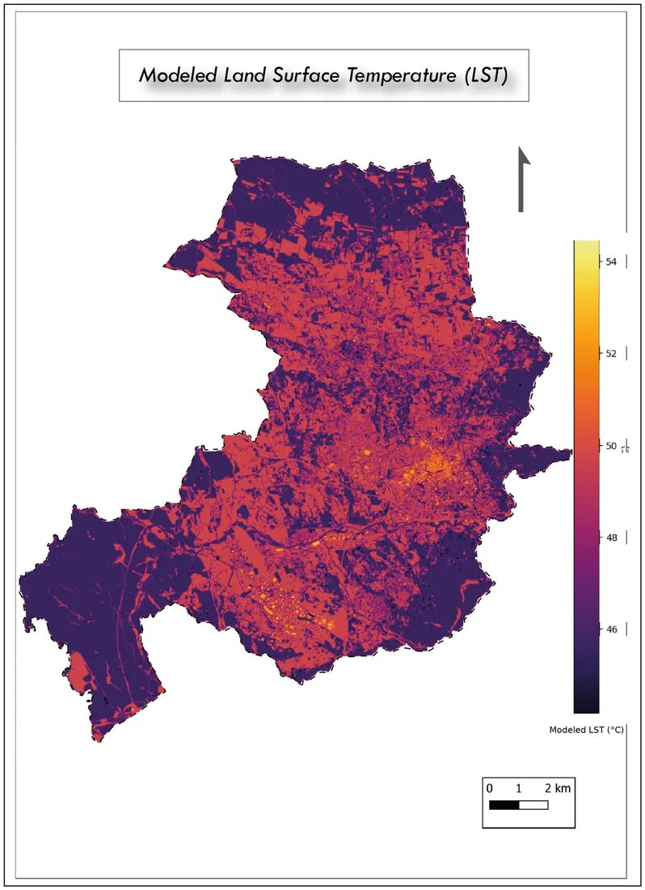
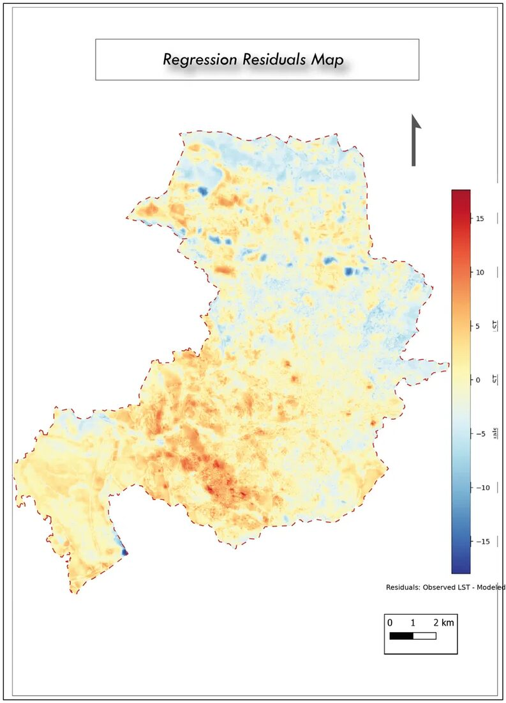

# Cartographie des îlots de chaleur urbains à Aix-en-Provence

**Mapping Urban Heat Islands in Aix-en-Provence through Remote Sensing and Local Climate Zones (LCZ)**

Mémoire de Master 1 — Géomatique et Modélisation Spatiale
Aix-Marseille Université, ALLSH
**Auteur :** SOUKOU A. Ezechiel · **Encadrant :** Sébastien Bridier · Année 2025–2026

---

## Résumé

Cette étude cartographie et caractérise l'îlot de chaleur urbain (ICU) de la commune d'Aix-en-Provence lors d'un épisode de canicule (16 août 2025), en croisant la température de surface (LST) issue de l'imagerie Landsat 8 avec une classification en Local Climate Zones (LCZ, Stewart & Oke, 2012).

Une grille de **210 036 cellules de 30 m**, construite à partir des données BD TOPO et Corine Land Cover, a permis de calculer cinq indicateurs morphologiques (fraction bâtie, fraction de végétation, fraction imperméable, hauteur moyenne du bâti, classe de rugosité) et de les croiser avec la LST observée.

**Résultats clés :**
- La classe **LCZ 8 (grand bâti bas)** présente l'intensité d'ICU la plus élevée (**+2,90 °C** par rapport à la référence rurale)
- L'eau et la végétation arborée exercent le plus fort effet rafraîchissant (**-6,64 °C** et **-3,36 °C**)
- La classe **LCZ 1 (centre historique compact)**, qui n'émerge qu'à cette résolution fine, présente une intensité d'ICU de surface quasi nulle (**-0,13 °C**) — interprétée à la lumière de la divergence entre ICU de surface et ICU de canopée
- Un modèle de régression linéaire multiple confirme le rôle prépondérant de la fraction bâtie et de la fraction de végétation (**R² = 0,247**)

**Mots-clés :** îlot de chaleur urbain, local climate zones, télédétection, température de surface, Landsat, Aix-en-Provence

---

## Contenu du dépôt

| Dossier / fichier | Contenu |
|---|---|
| `notebooks/` | Notebook Google Colab — chaîne de traitement complète (GEE, calcul LST, classification LCZ, régression) |
| `rapport/` | Article scientifique complet (FR/EN, .docx et .pdf) |
| `presentation/` | Support de soutenance (PowerPoint/Keynote) |
| `figures/` | Figures principales du mémoire (cartes, graphiques) |

*(Adapte les noms de dossiers ci-dessus à l'arborescence réelle de ton dépôt une fois les fichiers ajoutés.)*

---

## Zone d'étude et données

La zone d'étude correspond à la commune d'Aix-en-Provence (code INSEE 13001, ~186 km²), au climat méditerranéen marqué par des étés chauds et secs propices aux épisodes caniculaires.

| Donnée | Source | Résolution | Rôle |
|---|---|---|---|
| Landsat 8 (ST_B10) | USGS / Google Earth Engine | 30 m | Calcul de la LST |
| Limite communale, bâti, végétation, routes, hydrographie | IGN — BD TOPO | Vecteur | Indicateurs morphologiques |
| Corine Land Cover | Copernicus | 100 m | Correction des lacunes BD TOPO |

*Figure 1 — Localisation d'Aix-en-Provence dans son contexte régional (Bouches-du-Rhône / PACA).*

---

## Méthodologie (résumé)

1. **Calcul de la LST** à partir de la bande thermique ST_B10 (Landsat 8 Collection 2, Niveau 2), image du 16 août 2025 sélectionnée pour ses conditions de canicule confirmées (Tmax 40,1 °C), faible couverture nuageuse et vent faible.
2. **Grille d'analyse de 30 m** (210 036 cellules), résolution alignée sur le capteur thermique natif.
3. **Cinq indicateurs morphologiques** calculés par intersection géométrique avec la BD TOPO : fraction bâtie, fraction de végétation, fraction imperméable, hauteur moyenne du bâti, classe de rugosité.
4. **Classification LCZ** par arbre de décision (17 classes Stewart & Oke, 2012), corrigée via Corine Land Cover et l'hydrographie.
5. **Régression linéaire multiple (OLS)** pour quantifier la contribution de chaque indicateur à la variabilité spatiale de la LST.
6. **Calcul de l'intensité de l'ICU** par classe LCZ, relativement à la référence rurale (LCZ D).

---

## Résultats

*Figure 2 — Température de surface (LST) observée, grille 30 m.*

*Figure 3 — Carte de classification Local Climate Zone (LCZ), grille 30 m.*

*Figure 4 — Distribution de la température de surface par classe LCZ, avec référence rurale.*

*Figure 5 — Température de surface modélisée à partir des indicateurs morphologiques.*

*Figure 6 — Carte des résidus de régression (LST observée − LST modélisée).*

### Modèle de régression

| Variable | Coefficient | p-value |
|---|---|---|
| Constante | 43,919 | < 0,001 |
| Fraction bâtie | **+4,927** | < 0,001 |
| Fraction de végétation | **-4,121** | < 0,001 |
| Fraction imperméable | +0,119 | 0,095 (n.s.) |
| Hauteur moyenne | +0,148 | < 0,001 |
| Classe de rugosité | +0,723 | < 0,001 |

R² = 0,247 · n = 210 036 cellules · F = 1,377 × 10⁴ (p < 0,001)

---

## Limites et perspectives

- Facteur de vue du ciel (sky view factor) et admittance thermique non intégrés (nécessitent un MNS 3D)
- Une seule date d'observation, pas de campagne de validation terrain
- Perspectives : NDVI (Sentinel-2), seconde date d'observation, campagne terrain, intégration du sky view factor

---

## Références

- Grimmond, C. S. B., & Oke, T. R. (1999). *Aerodynamic properties of urban areas derived from analysis of surface form.* Journal of Applied Meteorology, 38(9), 1262–1292.
- Oke, T. R. (1982). *The energetic basis of the urban heat island.* QJRMS, 108(455), 1–24.
- Oke, T. R., Mills, G., Christen, A., & Voogt, J. A. (2017). *Urban Climates.* Cambridge University Press.
- Stewart, I. D., & Oke, T. R. (2012). *Local climate zones for urban temperature studies.* BAMS, 93(12), 1879–1900.
- U.S. Geological Survey (USGS). (2021). *Landsat 8 Collection 2 (C2) Level-2 Science Product Guide.*

---

## Auteur

**SOUKOU A. Ezechiel** — Master 1 Géomatique et Modélisation Spatiale, Aix-Marseille Université (ALLSH)
Encadrant : Sébastien Bridier
